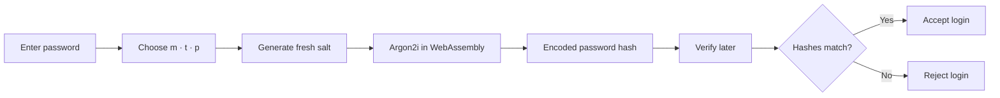
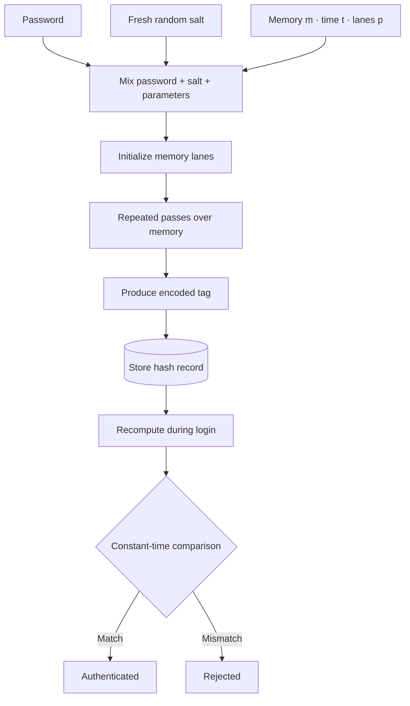
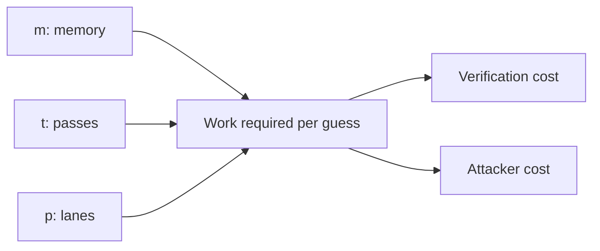

# Argon2i Password Hashing Lab

> An interactive, browser-based virtual laboratory for understanding password hashing, Argon2i parameters, verification, and memory-hardness.

<p align="center">
  <a href="https://argon2.lebronpereira.in"><strong>Live demo</strong></a>
  ·
  <a href="https://github.com/aaryas147/Argon2i/blob/main/tests.html">Run the test suite</a>
</p>


## Explore the lab

The lab follows a complete password-verification journey:



### What you can do

| Area | Experience |
| --- | --- |
| **Theory** | Learn hashing vs. encryption, memory-hardness, variants, and encoded hashes. |
| **Procedure** | Follow the experiment step by step. |
| **Experiment** | Generate Argon2i hashes and verify passwords locally. |
| **Analysis** | Benchmark memory cost, time cost, and parallelism. |
| **Test Cases** | Run documented and interactive checks against the real implementation. |
| **Quiz** | Check your understanding with feedback and scoring. |

## Live demo

Open the hosted lab at **[argon2.lebronpereira.in](https://argon2.lebronpereira.in)**.

The project has no backend. Passwords stay in the browser and are never sent to a server by the lab.

## Why Argon2i?

Argon2 is designed to make password guessing expensive by using memory as part of the computation. Argon2i uses data-independent memory access, which is useful when side-channel resistance is important.



## Parameters at a glance

| Parameter | Meaning | Increasing it generally does |
| --- | --- | --- |
| `m` — memory cost | RAM used, in KiB | Makes each password guess require more memory. |
| `t` — time cost | Number of passes over memory | Increases computation time. |
| `p` — parallelism | Number of lanes/threads | Splits work across lanes and changes resource usage. |



> Parameters should be benchmarked on the real server that will verify passwords. This lab is for learning and comparison, not a production tuning prescription.

## Encoded hash anatomy

```text
$argon2i$v=19$m=65536,t=3,p=2$<salt>$<tag>
```

| Segment | Meaning |
| --- | --- |
| `argon2i` | Algorithm variant |
| `v=19` | Argon2 version |
| `m=65536` | 64 MiB memory (`65536` KiB) |
| `t=3` | Three passes |
| `p=2` | Two lanes |
| `<salt>` | Unique random salt |
| `<tag>` | Derived password-verification result |

## Quick start

### Requirements

- A modern browser: Chrome, Firefox, Edge, or Safari
- Internet access for the `argon2-browser` CDN dependency
- Python 3 for a local server, if desired

### Run locally

```bash
git clone https://github.com/aaryas147/Argon2i.git
cd Argon2i
python3 -m http.server 8000
```

Then open <http://localhost:8000>.

On Windows, use:

```bash
py -m http.server 8000
```

Opening `index.html` directly may work, but a local server is more reliable for the WebAssembly and video assets.

## Suggested learning path

1. Read **Theory** to understand hashing, variants, salts, and cost parameters.
2. Follow **Procedure** once without changing the defaults.
3. Use **Experiment** to generate a hash and verify the original password.
4. Change one parameter at a time in **Analysis**.
5. Compare the measured execution times.
6. Open **Test Cases** and run the automated checks.
7. Finish with the **Quiz**.

## Test suite

The repository includes an interactive test runner at [`tests.html`](tests.html).

It checks the real lab logic, including:

- Hash format and variant
- Salt uniqueness
- Deterministic output with fixed inputs
- Password verification and rejection
- Parameter handling
- Benchmark behavior
- Quiz mechanics

Open <http://localhost:8000/tests.html> after starting the local server and select **Run All Tests**.

## Project structure

```text
Argon2i/
├── index.html          # Theory, procedure, experiment, analysis, quiz, and references
├── style.css           # Layout, responsive styling, animation, and visual system
├── script.js           # Hashing, verification, benchmarks, navigation, and quiz logic
├── tests.html          # Interactive automated test runner
├── tests.js            # Test definitions and assertions
├── assets/
│   └── CSS.mp4         # Embedded theory lesson video
└── README.md
```

## Tech stack

| Layer | Technology |
| --- | --- |
| Structure | HTML5 |
| Styling | CSS3 |
| Logic | Vanilla JavaScript |
| Cryptography | [`argon2-browser`](https://github.com/antelle/argon2-browser) v1.18.0 |
| Execution | WebAssembly in the browser |
| Video | Local MP4 asset with native browser controls |

There is no backend and no build step.

## Team

- [Aarya Sawant](https://www.linkedin.com/in/aarya-sawant-14643134/)
- [Disha Shetty](https://www.linkedin.com/in/disha-shetty-606615352/)
- [Chris Pereira](https://www.linkedin.com/in/chris-pereira-543119330/)
- [Lebron Pereira](https://www.linkedin.com/in/lebronpereira/)

## References

- A. Biryukov, D. Dinu, and D. Khovratovich, *Argon2: the memory-hard function for password hashing and other applications*
- [RFC 9106 — Argon2 Memory-Hard Function for Password Hashing and Proof-of-Work Applications](https://www.rfc-editor.org/rfc/rfc9106)
- [Password Hashing Competition](https://www.password-hashing.net/)
- [`argon2-browser`](https://github.com/antelle/argon2-browser)

## Scope and safety note

This is an educational virtual laboratory. Use a maintained server-side password-hashing library and benchmark production parameters in the environment where passwords will actually be verified.
